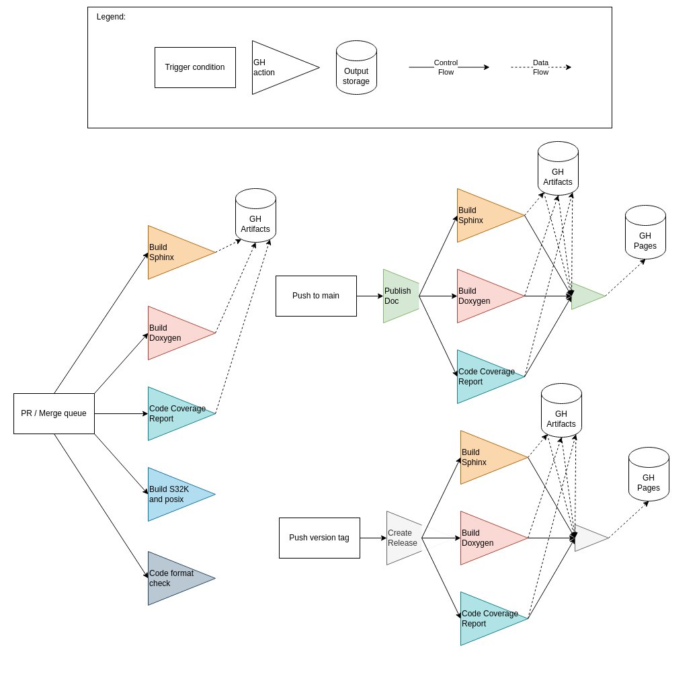

# Github Workflows

## Overview

## PR verification

To ensure a stable main branch we verify PRs once they are created/updated and again when they are accepted and enter the merge queue. Therefore each verification workflow needs to have both ``pull_request`` and ``merge_group`` set in the trigger conditions.
Additionally all jobs for the merge queue have to be explicitly added in the [otterdog configuration](https://github.com/eclipse-openbsw/.eclipsefdn/blob/main/otterdog/eclipse-openbsw.jsonnet).

## General guidelines

1. Don't waste compute time.
2. Each job should have a specific purpose.
3. Each artifact produced should make sense on it's own.
4. Don't rely on a different job running afterwards. Keep cohesion low.
