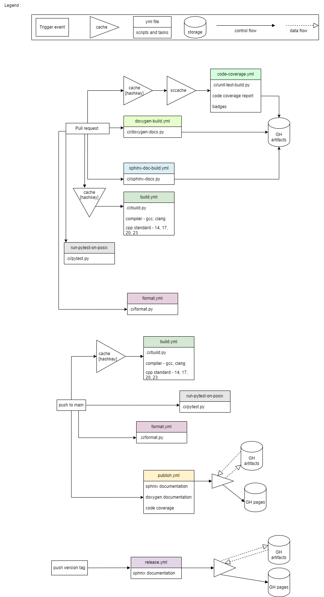

# Github Workflows

## Overview

## General guidelines

1. Don't waste compute time.
2. Each job should have a specific purpose.
3. Each artifact produced should make sense on it's own.
4. Don't rely on a different job running afterwards. Keep cohesion low.
